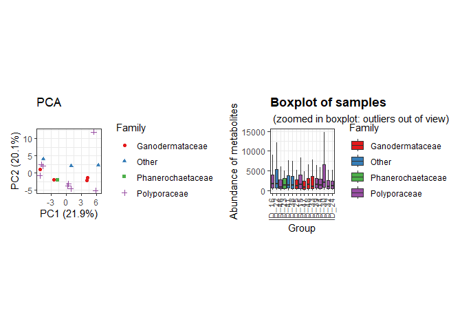
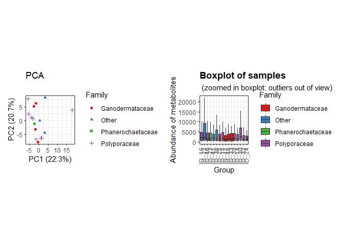
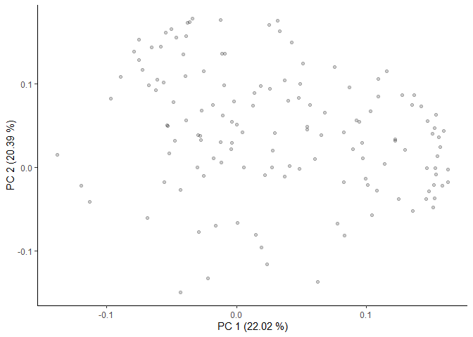

GC-MS of wood fungi
================
Jefferson Pastuña
2023-08-04

- <a href="#introduction" id="toc-introduction">Introduction</a>
- <a href="#before-to-start" id="toc-before-to-start">Before to start</a>
- <a href="#notame-workflow" id="toc-notame-workflow">Notame workflow</a>
- <a href="#preprocessing" id="toc-preprocessing">Preprocessing</a>
- <a href="#second-pca-and-loading-plot"
  id="toc-second-pca-and-loading-plot">Second PCA and loading plot</a>

## Introduction

The present document aims to record the procedure given for the
statistical analysis of secondary metabolites present in the different
fungi species. For each step a brief explanation, the code and graphics
obtained are included.

The workflow used is taken from the paper [“notame”: Workflow for
Non-Targeted LC–MS Metabolic
Profiling](https://doi.org/10.3390/metabo10040135). Which offers a wide
variety of functions to perform metabolomic profile analysis.

## Before to start

The “notame” package accepts as input a feature table that can be
obtained through software such as MZMine, MSDial, among others. In this
case, the feature table was obtained with the help of MZmine. The
(\*.txt) file was slightly modified to obtain the final feature table to
notame R package.

Modifications made to the raw (\*.txt) file can be summarized in adding
and renaming columns. The added columns “Column” and “Ion Mode” allow to
analyze samples with different types of columns and with different
ionization modes respectively. Also, the cells corresponding to mass and
retention time must be renamed so that the package can detect and
process it.

## Notame workflow

As a first step for the analysis, all the necessary libraries were
installed and loaded.

``` r
library(notame)
library(Biobase)
library(BiocGenerics)
library(futile.logger)
library(ggplot2)
library(magrittr)
library(foreach)
library(iterators)
library(parallel)
library(doParallel)
library(pcaMethods)
library(patchwork)
library(cowplot)
library(Rtsne)
library(ggdendro)
library(dplyr)
library(readxl)
library(ggsci)
library(missForest)
```

Then, a project path and a log system was added to have a record of each
process executed.

``` r
ppath <- "C:/Users/F4ss0/Documents/Ikiam21062022/Wood_Fungi/"
init_log(log_file = paste0(ppath, "Result/log.txt"))
```

    ## INFO [2023-08-05 00:29:32] Starting logging

Next, the feature list was imported.

``` r
data <- read_from_excel(file = "Data/Isabel_Fungi_to_R.xlsx", sheet = 3, 
                        corner_row = 8, corner_column = "G", 
                        split_by = c("Column", "Ion Mode"))
```

Once the data was read, the next step was to create a MetaboSet in order
to create a specific R object.

``` r
modes <- construct_metabosets(exprs = data$exprs, 
                              pheno_data = data$pheno_data, 
                              feature_data = data$feature_data,
                              group_col = "Group")
```

Finally, each mode was extracted in a single object.

``` r
mode <- modes$Rxt5_EI
```

As a additional step, we can visualize the raw data in order to inspect
the processing routines.

``` r
# Data extraction of all dataset
test_mode <- modes$Rxt5_EI
# Peak height matrix extraction
peak_matrix <- exprs(test_mode)
# Sample information extraction
sample_info <- test_mode@phenoData@data
# Transposed matrix
transp_matrix  <- t(peak_matrix)
# Change NA for 0 value
transp_matrix[is.na(transp_matrix)]=0
# Centered and scaled
raw_pca <- prcomp(transp_matrix, center = T, scale. = T)
# Matrix to PCA
raw_scores <- raw_pca$x %>%                  # scores
  data.frame %>%                             # 2D data
  mutate(Sample_ID = rownames(.)) %>%        # Empty column to sample information
  left_join(sample_info)                     # Join sample information
# Plot raw PCA
ggplot(raw_scores, aes(PC1, PC2, shape = Family, color = Family)) +
  geom_point(size = 3) +
  #geom_text(label=sample_info$Code, nudge_x = 1, nudge_y = 1, show.legend = FALSE) +
  guides(x=guide_axis(title = "PC1 (20.17 %)"), y=guide_axis(title = "PC2 (0.0925 %)")) +
  theme_classic()
```

<!-- -->

## Preprocessing

The first step of the preprocessing is to change the features with value
equal to 0 to NA.

``` r
mode <- mark_nas(mode, value = 0)
```

Then, features with low detection rate are first flagged and then will
be removed. The notame package employs two criteria to select this
features. First, is the feature presence in a percentage of QC
injections, and then the feature presence in a percentage within a
sample group or class.

``` r
mode <- flag_detection(mode, qc_limit = 0.70, group_limit = 0.9)
```

With these values, features which that were not detected in the 70% of
the QC injections and 90% of sample groups will be discarded.

The next step for preprocessing correspond to drift correction. The
drift correction can be applied by smoothed cubic spline regression.

``` r
corrected <- correct_drift(mode)
corrected <- correct_drift(corrected)   # Second correction to improve drift correction
corrected <- correct_drift(corrected)   # Third correction to improve drift correction
corrected <- correct_drift(corrected)
corrected <- correct_drift(corrected)
corrected <- flag_quality(corrected, condition = "RSD_r < 0.3 & D_ratio_r < 0.5")
```

Then we can visualize the correction for QCs.

``` r
EI_corr_sambx <- plot_sample_boxplots(corrected, order_by = "Group", fill_by = "Family")
EI_corr_pca <- plot_pca(corrected, center = T, shape = "Family", color = "Family") 
EI_corr_pca + EI_corr_sambx
```

<!-- -->

Contaminant peaks based on the Process Blank were removed with MZmine
3.7.0, therefore there are not the Process Blank group in the dataset.

``` r
#corrected_no_blank <- corrected[, corrected$Group != "Blank"]
```

The next step removes the QC from the analysis, since they will not be
needed in subsequent treatments.

``` r
corrected_no_qc <- drop_qcs(corrected)
```

We can visualize data without QC.

``` r
EI_corr_sambx <- plot_sample_boxplots(corrected_no_qc, order_by = "Group", fill_by = "Family")
EI_corr_pca <- plot_pca(corrected_no_qc, center = T, shape = "Family", color = "Family") 
EI_corr_pca + EI_corr_sambx
```

<!-- -->

The next step is feature clustering. This step helps us reduce the
number of features of the same molecule that were split due to EI
ionization behavior.

``` r
EI_clustered <- cluster_features(corrected_no_qc, rt_window = 1/60, 
                                    all_features = T,
                                    corr_thresh = 0.9, 
                                    d_thresh = 0.8)
EI_compressed <- compress_clusters(EI_clustered)
```

We can inspect PCA plot after clustering algorithm.

``` r
EI_corr_sambx <- plot_sample_boxplots(EI_compressed, order_by = "Group", fill_by = "Family")
EI_corr_pca <- plot_pca(EI_compressed, center = T, shape = "Family", color = "Family") 
EI_corr_pca + EI_corr_sambx
```

<!-- -->

Finally the next step imputes the data.

``` r
# Clean data
set.seed(81)
imputed <- impute_rf(EI_compressed)
```

    ## INFO [2023-08-05 00:33:24] 
    ## Starting random forest imputation at 2023-08-05 00:33:24
    ## INFO [2023-08-05 00:33:28] Out-of-bag error in random forest imputation: 1.337
    ## INFO [2023-08-05 00:33:28] Random forest imputation finished at 2023-08-05 00:33:28

``` r
# All data
#imputed <- impute_rf(imputed, all_features = TRUE)
```

We can inspect PCA plot after imputation.

``` r
EI_corr_sambx <- plot_sample_boxplots(imputed, order_by = "Group", fill_by = "Family")
EI_corr_pca <- plot_pca(imputed, center = T, shape = "Family", color = "Family") 
EI_corr_pca + EI_corr_sambx
```

<!-- -->

# Second PCA and loading plot

Droping flagged features

``` r
no_flag <- drop_flagged(imputed)

# Extracting feature table (Expression data)
peak_Height <- exprs(no_flag)

# Extracting Phenotipic data
EI_pheno_data <- no_flag@phenoData@data
```

Preparing data and transposing feature table.

``` r
EI_feat_table_pca  <- t(peak_Height)

#Changing NA to 0 
EI_feat_table_pca[is.na(EI_feat_table_pca)]=0

# Centering and Scaling features
EI_pca <- prcomp(EI_feat_table_pca, center = T, scale. = T)
```

Plotting PCA results.

``` r
scores <- EI_pca$x %>%               # Get PC coordinates
  data.frame %>%                            # Convert to data frames
  mutate(Sample_ID = rownames(.)) %>%       # Create a new column with the sample names
  left_join(EI_pheno_data )                  # Adding metadata

ggplot(scores, aes(PC1, PC2, shape = Family, color = Family)) +
  geom_point(size = 3) +
  guides(x=guide_axis(title = "PC 1 (22.02 %)"), y=guide_axis(title = "PC 2 (20.39 %)")) +
  theme_classic()
```

<!-- -->

``` r
# Save plot
#ggsave('Result/GC-MS/GC_MS_EI_Score_Plot.png', width = 5, height = 4, device='png', dpi="print")
```

Plotting loading results.

``` r
loadings <- EI_pca$rotation %>%           # Extract loadings
  data.frame(Feature_name = rownames(.))  # New column with feat name
```

Creating an artificial table with Feature name and Compound column.

``` r
EI_feat_name <- readxl::read_excel("Data/EI_Metabolites.xlsx", 2)

# Creating a new small table of the annotated compounds
EI_compouds_all <- left_join(EI_feat_name, loadings)

# Plotting results
ggplot(loadings, aes(PC1, PC2)) + 
  geom_point(alpha = 0.2) +
  theme_classic() + 
  geom_point(data = EI_compouds_all, size = 1) +
  ggrepel::geom_label_repel(data = EI_compouds_all, aes(label = Compound), box.padding = 0.8, label.padding = 0.27, label.r = 0.3, cex = 3) +
  guides(x=guide_axis(title = "PC 1 (22.02 %)"), y=guide_axis(title = "PC 2 (20.39 %)")) +
  ggsci::scale_color_aaas()
```

<!-- -->

``` r
# Save plot
#ggsave('Result/GC-MS/GC_MS_EI_Loadings_Plot.png', width = 5, height = 4, device='png', dpi="print")
```

Finish a record.

``` r
finish_log()
```

    ## INFO [2023-08-05 00:33:35] Finished analysis. Sat Aug  5 00:33:35 2023
    ## Session info:
    ## 
    ## INFO [2023-08-05 00:33:35] R version 4.2.2 (2022-10-31 ucrt)
    ## INFO [2023-08-05 00:33:35] Platform: x86_64-w64-mingw32/x64 (64-bit)
    ## INFO [2023-08-05 00:33:35] Running under: Windows 10 x64 (build 19045)
    ## INFO [2023-08-05 00:33:35] 
    ## INFO [2023-08-05 00:33:35] Matrix products: default
    ## INFO [2023-08-05 00:33:35] 
    ## INFO [2023-08-05 00:33:35] locale:
    ## INFO [2023-08-05 00:33:35] [1] LC_COLLATE=Spanish_Spain.utf8  LC_CTYPE=Spanish_Spain.utf8   
    ## INFO [2023-08-05 00:33:35] [3] LC_MONETARY=Spanish_Spain.utf8 LC_NUMERIC=C                  
    ## INFO [2023-08-05 00:33:35] [5] LC_TIME=Spanish_Spain.utf8    
    ## INFO [2023-08-05 00:33:35] 
    ## INFO [2023-08-05 00:33:35] attached base packages:
    ## INFO [2023-08-05 00:33:35] [1] parallel  stats     graphics  grDevices utils     datasets  methods  
    ## INFO [2023-08-05 00:33:35] [8] base     
    ## INFO [2023-08-05 00:33:35] 
    ## INFO [2023-08-05 00:33:35] other attached packages:
    ## INFO [2023-08-05 00:33:35]  [1] missForest_1.5       ggsci_3.0.0          readxl_1.4.2.9000   
    ## INFO [2023-08-05 00:33:35]  [4] dplyr_1.1.0          ggdendro_0.1.23      Rtsne_0.17          
    ## INFO [2023-08-05 00:33:35]  [7] cowplot_1.1.2        patchwork_1.1.2.9000 pcaMethods_1.90.0   
    ## INFO [2023-08-05 00:33:35] [10] doParallel_1.0.14    iterators_1.0.14     foreach_1.5.2       
    ## INFO [2023-08-05 00:33:35] [13] notame_0.2.0         magrittr_2.0.3       ggplot2_3.4.1.9000  
    ## INFO [2023-08-05 00:33:35] [16] futile.logger_1.4.3  Biobase_2.58.0       BiocGenerics_0.44.0 
    ## INFO [2023-08-05 00:33:35] 
    ## INFO [2023-08-05 00:33:35] loaded via a namespace (and not attached):
    ## INFO [2023-08-05 00:33:35]  [1] ggrepel_0.9.2.9999   Rcpp_1.0.10          gert_1.9.2          
    ## INFO [2023-08-05 00:33:35]  [4] tidyr_1.3.0          digest_0.6.31        utf8_1.2.3          
    ## INFO [2023-08-05 00:33:35]  [7] R6_2.5.1             cellranger_1.1.0     futile.options_1.0.1
    ## INFO [2023-08-05 00:33:35] [10] sys_3.4.1            evaluate_0.20        highr_0.10          
    ## INFO [2023-08-05 00:33:35] [13] pillar_1.8.1         itertools_0.1-3      rlang_1.0.6         
    ## INFO [2023-08-05 00:33:35] [16] rstudioapi_0.14      rmarkdown_2.20       labeling_0.4.2      
    ## INFO [2023-08-05 00:33:35] [19] igraph_1.4.1.9002    munsell_0.5.0        compiler_4.2.2      
    ## INFO [2023-08-05 00:33:35] [22] xfun_0.37            pkgconfig_2.0.3      askpass_1.1         
    ## INFO [2023-08-05 00:33:35] [25] htmltools_0.5.4      openssl_2.0.5        tidyselect_1.2.0    
    ## INFO [2023-08-05 00:33:35] [28] tibble_3.1.8         codetools_0.2-18     randomForest_4.7-1.1
    ## INFO [2023-08-05 00:33:35] [31] fansi_1.0.4          viridisLite_0.4.1    withr_2.5.0         
    ## INFO [2023-08-05 00:33:35] [34] MASS_7.3-58.1        grid_4.2.2           gtable_0.3.1        
    ## INFO [2023-08-05 00:33:35] [37] lifecycle_1.0.3      formatR_1.14         credentials_1.3.2   
    ## INFO [2023-08-05 00:33:35] [40] scales_1.2.1         zip_2.2.2            cli_3.6.0           
    ## INFO [2023-08-05 00:33:35] [43] stringi_1.7.12       farver_2.1.1         fs_1.6.1            
    ## INFO [2023-08-05 00:33:35] [46] doRNG_1.8.6          generics_0.1.3       vctrs_0.5.2         
    ## INFO [2023-08-05 00:33:35] [49] openxlsx_4.2.5.2     lambda.r_1.2.4       RColorBrewer_1.1-3  
    ## INFO [2023-08-05 00:33:35] [52] tools_4.2.2          glue_1.6.2           purrr_1.0.1         
    ## INFO [2023-08-05 00:33:35] [55] rngtools_1.5.2       fastmap_1.1.0        yaml_2.3.7          
    ## INFO [2023-08-05 00:33:35] [58] colorspace_2.1-0     knitr_1.42           usethis_2.1.6
